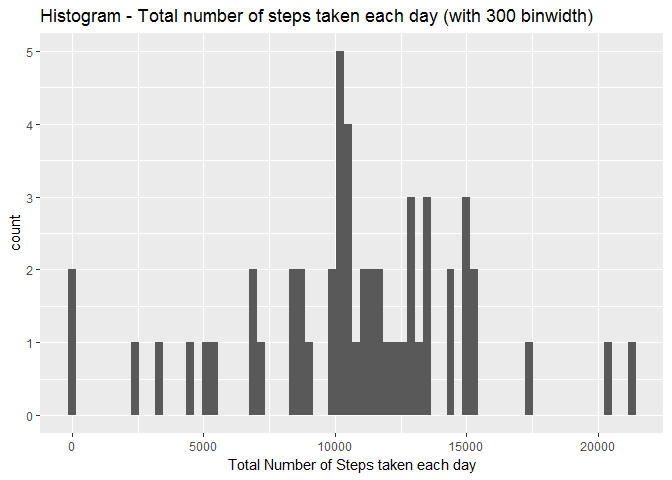
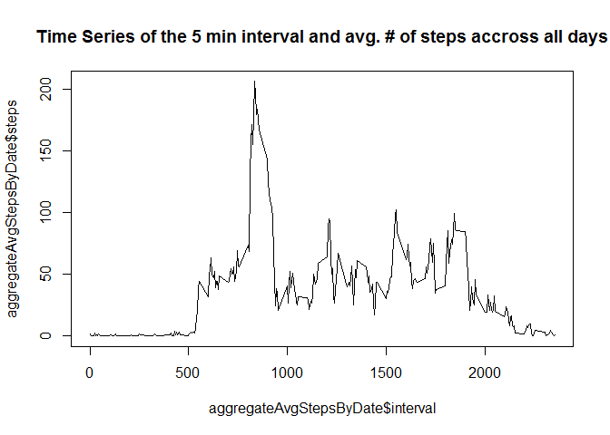
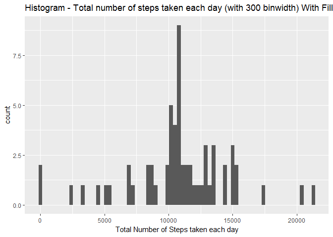
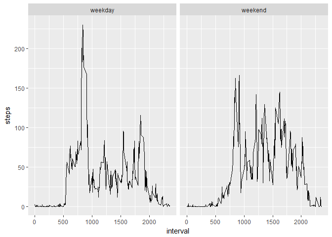

# Reproducible Research: Peer Assessment 1

## Loading Packages and Libraries

```r
install.packages("ggplot2")
```

```
## Installing package into 'C:/Users/machury/Documents/R/win-library/3.4'
## (as 'lib' is unspecified)
```

```
## package 'ggplot2' successfully unpacked and MD5 sums checked
## 
## The downloaded binary packages are in
## 	C:\Users\machury\AppData\Local\Temp\1\RtmpsZDc0L\downloaded_packages
```

```r
library(ggplot2)
```

## Loading and preprocessing the data

```r
activityData <- read.csv("data\\activity.csv")
activityData$date <- as.Date(activityData$date, format = "%Y-%m-%d")
```

## What is mean total number of steps taken per day?


```r
#For this part of the assignment ignore the missing values in the dataset.
activityDataWithoutMissingValues <- na.omit(activityData)
aggregateStepsByDate <- aggregate(steps ~ date, activityDataWithoutMissingValues, sum)

#Make a histogram of the total number of steps taken each day
qplot(aggregateStepsByDate$steps, geom="histogram", xlab = "Total Number of Steps taken each day", main = "Histogram - Total number of steps taken each day (with 300 binwidth)", binwidth = 300)
```

<!-- -->

```r
summary(aggregateStepsByDate)
```

```
##       date                steps      
##  Min.   :2012-10-02   Min.   :   41  
##  1st Qu.:2012-10-16   1st Qu.: 8841  
##  Median :2012-10-29   Median :10765  
##  Mean   :2012-10-30   Mean   :10766  
##  3rd Qu.:2012-11-16   3rd Qu.:13294  
##  Max.   :2012-11-29   Max.   :21194
```
You can see from the above table that the mean is 1.0766189\times 10^{4}, while the median is 10765.


## What is the average daily activity pattern?


```r
aggregateAvgStepsByDate <- aggregate(steps ~ interval, activityDataWithoutMissingValues, mean)
plot(aggregateAvgStepsByDate$interval, aggregateAvgStepsByDate$steps, type ="l", main = "Time Series of the 5 min interval and avg. # of steps accross all days")
```

<!-- -->

```r
aggregateAvgStepsByDate[which.max(aggregateAvgStepsByDate$steps), ]
```

```
##     interval    steps
## 104      835 206.1698
```
On Average accross all the days in the dataset, the 5 minute interval  835 contains the maximun number of steps.

## Imputing missing values

The total number of rows with NAs:


```r
sum(is.na(activityData))
```

```
## [1] 2304
```


```r
#Using the Avg. # of steps for the missing 5 minute interval, fill in the missing value

activityDataWithCompleteValues <- merge(activityData, aggregateAvgStepsByDate, by = c("interval"))

activityDataWithCompleteValues$steps <- ifelse(is.na(activityDataWithCompleteValues$steps.x) == TRUE,activityDataWithCompleteValues$steps.y, activityDataWithCompleteValues$steps.x)

activityDataWithCompleteValues <- subset(activityDataWithCompleteValues, select=-c(steps.x,steps.y))

# Make a histogram
aggregateStepsByDate_WithFill <- aggregate(steps ~ date, activityDataWithCompleteValues, sum)

#Make a histogram of the total number of steps taken each day
qplot(aggregateStepsByDate_WithFill$steps, geom="histogram", xlab = "Total Number of Steps taken each day", main = "Histogram - Total number of steps taken each day (with 300 binwidth) With Fill", binwidth = 300)
```

<!-- -->


```r
summary(aggregateStepsByDate_WithFill)
```

```
##       date                steps      
##  Min.   :2012-10-01   Min.   :   41  
##  1st Qu.:2012-10-16   1st Qu.: 9819  
##  Median :2012-10-31   Median :10766  
##  Mean   :2012-10-31   Mean   :10766  
##  3rd Qu.:2012-11-15   3rd Qu.:12811  
##  Max.   :2012-11-30   Max.   :21194
```

When compared to the original histogram prior to filling in the NA values, the avg stayed the same and the median only changed slightly. No significant changes to the histogram are found.

## Are there differences in activity patterns between weekdays and weekends?


```r
activityDataWithCompleteValues$DayType <- factor(ifelse(weekdays(activityDataWithCompleteValues$date, abbr = TRUE) %in% c("Sat", "Sun"), "weekend", "weekday"))

aggregateAvgStepsByDateAndDateType <- aggregate(steps ~ interval+DayType, activityDataWithCompleteValues, mean)

qplot(interval,
      steps,
      data = aggregateAvgStepsByDateAndDateType,
      facets = .~ DayType,
      geom = "line")
```

<!-- -->

